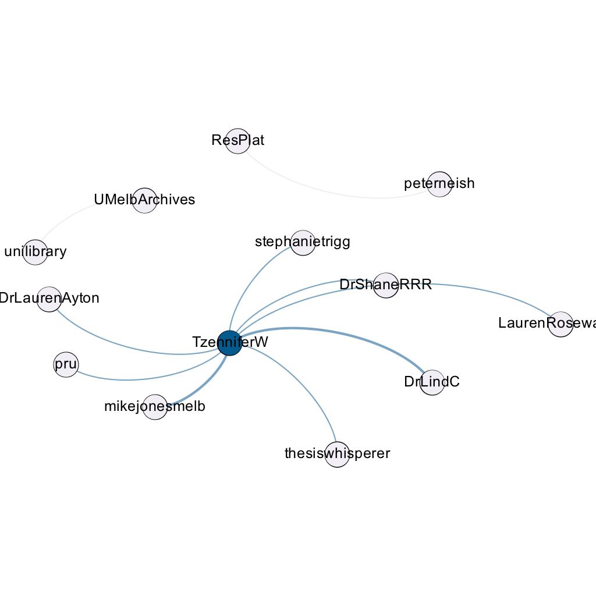
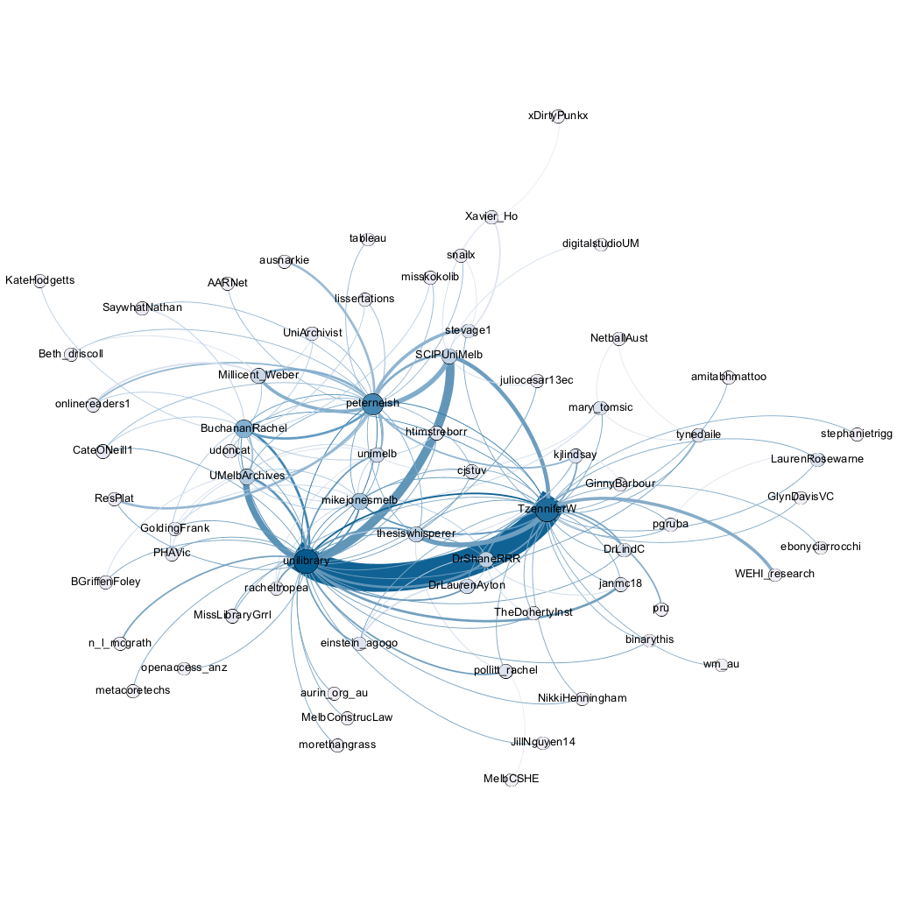
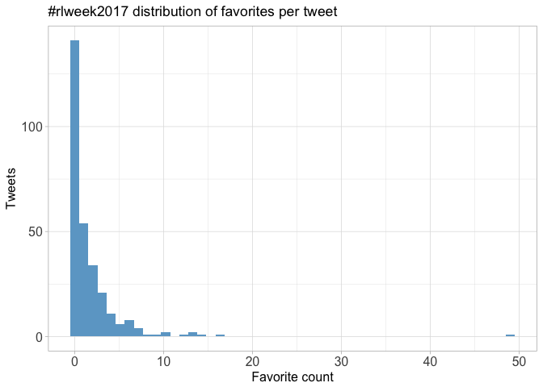

# Twitter Coverage of Researcher<!-- -->@Library Week 2017
Peter Neish  
`r Sys.time()`  


# Introduction
An analysis of tweets from Researcher<!-- -->@Lbrary Week 2017. 289
tweets were collected using the `rtweet` R package:


```r
rlweek <- search_tweets("#rlweek2017", 10000)
saveRDS(rlweek, "data/rlweek.rds")
```

## Search all the hashtags!
<!-- -->

# Timeline
## Tweets by day
<!-- -->

## Tweets by day and time
Filtered for dates August 21-25, Melbourne time.
<!-- -->

# Users
## Top tweeters
<!-- -->

## Sources
<!-- -->

# Networks
## Replies
The "replies network", composed from users who reply directly to one another, 
coloured by page rank.

Click to view image.


[](data/rlweek_replies.png)

## Mentions
The "mentions network", where users mention other users in their tweets.
Filtered for k-core >= 4 and coloured by modularity class.

Click to show image.


[](data/rlweek_mentions.png)

# Retweets
## Retweet proportion
<!-- -->

## Retweet count
<!-- -->

## Top retweets
<table>
 <thead>
  <tr>
   <th style="text-align:left;"> screen_name </th>
   <th style="text-align:left;"> text </th>
   <th style="text-align:right;"> retweet_count </th>
  </tr>
 </thead>
<tbody>
  <tr>
   <td style="text-align:left;"> peterneish </td>
   <td style="text-align:left;"> Metadata is not neutral - people decide what to put in and what to leave out @BuchananRachel #rlweek2017 </td>
   <td style="text-align:right;"> 8 </td>
  </tr>
  <tr>
   <td style="text-align:left;"> unilibrary </td>
   <td style="text-align:left;"> Support services available to #researchers at @unimelb who want to work with #data - in addition to @UMelbArchives… https://t.co/O1Iqey2jfK </td>
   <td style="text-align:right;"> 7 </td>
  </tr>
  <tr>
   <td style="text-align:left;"> unilibrary </td>
   <td style="text-align:left;"> #Research communication tips:
-Find a mentor
-Start small &amp;amp; build up
-Reciprocate help
-Be adaptable
-Say yes to opportunities 
#rlweek2017 </td>
   <td style="text-align:right;"> 5 </td>
  </tr>
  <tr>
   <td style="text-align:left;"> TzenniferW </td>
   <td style="text-align:left;"> Academics need to know their rights &amp;amp; know the requirements for disseminating their research outputs @GinnyBarbour #rlweek2017 @unilibrary </td>
   <td style="text-align:right;"> 5 </td>
  </tr>
  <tr>
   <td style="text-align:left;"> TzenniferW </td>
   <td style="text-align:left;"> Drs Hannah McCann &amp;amp; Mary Tomsic demystifying Wikipedia editing rules #HERsUoM #UoMwiki #rlweek2017 @unilibrary https://t.co/jCdoTXYx5B </td>
   <td style="text-align:right;"> 4 </td>
  </tr>
  <tr>
   <td style="text-align:left;"> TzenniferW </td>
   <td style="text-align:left;"> Pep talk from Provost Prof Margaret Sheil launches our #HERsUoM #Umwiki@unilibrary #rlweek2017 https://t.co/MWGJzNyFFu </td>
   <td style="text-align:right;"> 4 </td>
  </tr>
  <tr>
   <td style="text-align:left;"> TzenniferW </td>
   <td style="text-align:left;"> On now in @DrShaneRRR &amp;amp; stellar panel discussing research communication #rlweek2017 @unilibrary https://t.co/EE0mGabemL </td>
   <td style="text-align:right;"> 4 </td>
  </tr>
  <tr>
   <td style="text-align:left;"> mikejonesmelb </td>
   <td style="text-align:left;"> At 1pm today I’m part of a panel talking about Communicating your research, as part of #rlweek2017 @unimelb… https://t.co/NTnVx6Fr4L </td>
   <td style="text-align:right;"> 4 </td>
  </tr>
  <tr>
   <td style="text-align:left;"> TzenniferW </td>
   <td style="text-align:left;"> What is the cloud? Someone else's computer! Bernard Meade (ResPlats) Research &amp;amp; the Cloud #rlweek2017 @unilibrary https://t.co/IEb7ncgfOX </td>
   <td style="text-align:right;"> 4 </td>
  </tr>
  <tr>
   <td style="text-align:left;"> unilibrary </td>
   <td style="text-align:left;"> And congratulations to all who participated in the #rlweek2017 ePoster Competition Awards. Inspiring work all round. https://t.co/2HPr05sjbc </td>
   <td style="text-align:right;"> 4 </td>
  </tr>
</tbody>
</table>

# Favourites
## Favourite proportion
<!-- -->

## Favourite count
<!-- -->

## Top favourites
<table>
 <thead>
  <tr>
   <th style="text-align:left;"> screen_name </th>
   <th style="text-align:left;"> text </th>
   <th style="text-align:right;"> favorite_count </th>
  </tr>
 </thead>
<tbody>
  <tr>
   <td style="text-align:left;"> peterneish </td>
   <td style="text-align:left;"> Very popular #rlweek2017 session this morning on Research and the Cloud - presented by these people https://t.co/pXHGDSv5AF </td>
   <td style="text-align:right;"> 49 </td>
  </tr>
  <tr>
   <td style="text-align:left;"> TzenniferW </td>
   <td style="text-align:left;"> On now in @DrShaneRRR &amp;amp; stellar panel discussing research communication #rlweek2017 @unilibrary https://t.co/EE0mGabemL </td>
   <td style="text-align:right;"> 16 </td>
  </tr>
  <tr>
   <td style="text-align:left;"> TzenniferW </td>
   <td style="text-align:left;"> Drs Hannah McCann &amp;amp; Mary Tomsic demystifying Wikipedia editing rules #HERsUoM #UoMwiki #rlweek2017 @unilibrary https://t.co/jCdoTXYx5B </td>
   <td style="text-align:right;"> 14 </td>
  </tr>
  <tr>
   <td style="text-align:left;"> mary_tomsic </td>
   <td style="text-align:left;"> I've got coolest drink bottle at pool this morning @unimelb #rlweek2017 #twitterstorians https://t.co/PMIOL2f3xn </td>
   <td style="text-align:right;"> 13 </td>
  </tr>
  <tr>
   <td style="text-align:left;"> mikejonesmelb </td>
   <td style="text-align:left;"> At 1pm today I’m part of a panel talking about Communicating your research, as part of #rlweek2017 @unimelb… https://t.co/NTnVx6Fr4L </td>
   <td style="text-align:right;"> 13 </td>
  </tr>
  <tr>
   <td style="text-align:left;"> peterneish </td>
   <td style="text-align:left;"> Metadata is not neutral - people decide what to put in and what to leave out @BuchananRachel #rlweek2017 </td>
   <td style="text-align:right;"> 12 </td>
  </tr>
  <tr>
   <td style="text-align:left;"> peterneish </td>
   <td style="text-align:left;"> Data privacy and security risks. #rlweek2017 https://t.co/KVhmZlm2by </td>
   <td style="text-align:right;"> 10 </td>
  </tr>
  <tr>
   <td style="text-align:left;"> DrLaurenAyton </td>
   <td style="text-align:left;"> Had a ball at the #rlweek2017 research Comms event yesterday! Thanks @unilibrary, the great panel and host… https://t.co/h4VA4rJIC2 </td>
   <td style="text-align:right;"> 9 </td>
  </tr>
  <tr>
   <td style="text-align:left;"> janmc18 </td>
   <td style="text-align:left;"> My first Wikipedia page 😊 about Mildred Barnard, statistician. #HERsUoM #UoMwiki #rlweek2017 @unilibrary https://t.co/nSOdzEAVPX </td>
   <td style="text-align:right;"> 8 </td>
  </tr>
  <tr>
   <td style="text-align:left;"> UMelbArchives </td>
   <td style="text-align:left;"> Excited for final day of #rlweek2017 tomorrow with an edit-a-thon aimed at improving the representation of women on… https://t.co/uUoTCukBmZ </td>
   <td style="text-align:right;"> 7 </td>
  </tr>
</tbody>
</table>

# Quotes
## Quote proportion
<!-- -->

## Quote count
<!-- -->

## Top quotes
<table>
 <thead>
  <tr>
   <th style="text-align:left;"> screen_name </th>
   <th style="text-align:left;"> text </th>
   <th style="text-align:right;"> quote_count </th>
  </tr>
 </thead>
<tbody>
  <tr>
   <td style="text-align:left;"> peterneish </td>
   <td style="text-align:left;"> Greer's press card for Vietnam - she was everywhere. #rlweek2017 https://t.co/0O0kLvWm6Y </td>
   <td style="text-align:right;"> 2 </td>
  </tr>
  <tr>
   <td style="text-align:left;"> mary_tomsic </td>
   <td style="text-align:left;"> including history of @NetballAust in wikipedia #UoMwik #HERsUoM #twitterstorians #netball #rlweek2017 https://t.co/OB6OfcRptW </td>
   <td style="text-align:right;"> 2 </td>
  </tr>
</tbody>
</table>

# Media
## Media count
<!-- -->

## Top media
<table>
 <thead>
  <tr>
   <th style="text-align:left;"> screen_name </th>
   <th style="text-align:left;"> text </th>
   <th style="text-align:right;"> favorite_count </th>
  </tr>
 </thead>
<tbody>
  <tr>
   <td style="text-align:left;"> peterneish </td>
   <td style="text-align:left;"> Very popular #rlweek2017 session this morning on Research and the Cloud - presented by these people https://t.co/pXHGDSv5AF </td>
   <td style="text-align:right;"> 49 </td>
  </tr>
  <tr>
   <td style="text-align:left;"> TzenniferW </td>
   <td style="text-align:left;"> On now in @DrShaneRRR &amp;amp; stellar panel discussing research communication #rlweek2017 @unilibrary https://t.co/EE0mGabemL </td>
   <td style="text-align:right;"> 16 </td>
  </tr>
  <tr>
   <td style="text-align:left;"> TzenniferW </td>
   <td style="text-align:left;"> Drs Hannah McCann &amp;amp; Mary Tomsic demystifying Wikipedia editing rules #HERsUoM #UoMwiki #rlweek2017 @unilibrary https://t.co/jCdoTXYx5B </td>
   <td style="text-align:right;"> 14 </td>
  </tr>
  <tr>
   <td style="text-align:left;"> mary_tomsic </td>
   <td style="text-align:left;"> I've got coolest drink bottle at pool this morning @unimelb #rlweek2017 #twitterstorians https://t.co/PMIOL2f3xn </td>
   <td style="text-align:right;"> 13 </td>
  </tr>
  <tr>
   <td style="text-align:left;"> peterneish </td>
   <td style="text-align:left;"> Data privacy and security risks. #rlweek2017 https://t.co/KVhmZlm2by </td>
   <td style="text-align:right;"> 10 </td>
  </tr>
  <tr>
   <td style="text-align:left;"> peterneish </td>
   <td style="text-align:left;"> Data privacy and security risks. #rlweek2017 https://t.co/KVhmZlm2by </td>
   <td style="text-align:right;"> 10 </td>
  </tr>
  <tr>
   <td style="text-align:left;"> janmc18 </td>
   <td style="text-align:left;"> My first Wikipedia page 😊 about Mildred Barnard, statistician. #HERsUoM #UoMwiki #rlweek2017 @unilibrary https://t.co/nSOdzEAVPX </td>
   <td style="text-align:right;"> 8 </td>
  </tr>
  <tr>
   <td style="text-align:left;"> TzenniferW </td>
   <td style="text-align:left;"> Reliable sources for Wikipedia editing. #HERsUoM #UoMwiki #rlweek2017 @unilibrary https://t.co/NOnctgoHN0 </td>
   <td style="text-align:right;"> 6 </td>
  </tr>
  <tr>
   <td style="text-align:left;"> TzenniferW </td>
   <td style="text-align:left;"> Pep talk from Provost Prof Margaret Sheil launches our #HERsUoM #Umwiki@unilibrary #rlweek2017 https://t.co/MWGJzNyFFu </td>
   <td style="text-align:right;"> 6 </td>
  </tr>
  <tr>
   <td style="text-align:left;"> peterneish </td>
   <td style="text-align:left;"> Fantastic ePosters this year - well done everyone. #rlweek2017 https://t.co/7taZ9TMOWi </td>
   <td style="text-align:right;"> 6 </td>
  </tr>
</tbody>
</table>

### Most liked media images


# Tweet text
The 100 words used 3 or more times.

<!-- -->
